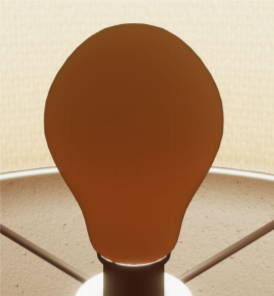
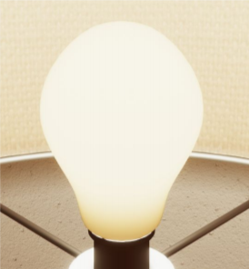

# Light Layers

The High Definition Render Pipeline (HDRP) allows you to use Light Layers, which are [LayerMasks](https://docs.unity3d.com/ScriptReference/LayerMask.html), to make Lights in your Scene only light up specific Meshes. You set Light Layers for Lights and Meshes to make Lights only affect Meshes that are on corresponding Light Layers.

## Enabling Light Layers

To use Light Layers, you must enable them in your Project’s [HDRP Asset](HDRP-Asset.html). You can then enable Light Layers in your default [Frame Settings](Frame-Settings.html) to set your Cameras to process Light Layers.

1. Select the HDRP Asset in the Project window and, in the Inspector, go to the **Lighting** section and enable the **Light Layers** checkbox.
2. To enable Light Layers in the default Frame Settings for all Cameras, in your HDRP Asset, go to the **Default Frame Settings For** section, select **Camera** from the drop-down and, in the **Lighting** section, enable the **Light Layers** checkbox. 

To override the Frame Settings for Cameras and set Light Layers on an individual basis:

1. Click on a Camera in the Scene view or Hierarchy window to view its properties in the Inspector. 
2. Go to the **General** section and enable the **Custom Frame Settings** checkbox. This exposes the **Frame Settings Overrides,** which you can use to customize this Camera only. 
3. In the **Lighting** section, enable the **Light Layers** checkbox to make this Camera use Light Layers.

## Using Light Layers

After you enable Light Layers, you can then use them to decouple Meshes from certain Lights in your Scene. To do this:

1. Click on a Light in the Hierarchy or the Scene view to view it in the Inspector.
2. Expose [more options](More-Options.html) in the **General** section to expose the **Light Layer** property.
3. Use the **Light Layer** property drop-down to select which Light Layers this Light affects.
4. Click on a Mesh Renderer in the Hierarchy or the Scene view to view it in the Inspector.
5. Use the **Rendering Layer Mask** drop-down to select which Light Layers affect this Mesh Renderer. When you enable Light Layers, a Light only affects a Mesh Renderer if they both use a matching Light Layer.

## Shadow Light Layers

When using Light Layers, Meshes only cast shadows for [Lights](Light-Component.html) on the same Light Layer as them. This is because HDRP synchronizes Light Layers and shadow Light Layers by default, so every Mesh that receives light, also casts shadows for it. To make a Mesh cast shadows without the Light also affecting its lighting, you must decouple the shadow Light Layers from that Light's Light Layers.

To do this:

1. Click on a Light in the Hierarchy or the Scene view to view it in the Inspector.
2. Go to the **Shadows** section and disable the **Link Light Layers** checkbox.

You can now use the **Light Layers** drop-down in the **Shadows** section to set the Light Layers that the Light uses for shadowing. You can also still use the **Light Layers** drop-down in the **General** section to set the Light Layers that the Light uses for lighting.

## Example scenario

Using [cookies](https://docs.unity3d.com/Manual/Cookies.html) for light fixtures can sometimes have a negative visual effect on a bulb, such as self-shadowing or transmission contribution. You can use Light Layers to make a bulb Mesh not receive any light from the Light’s cookie, and instead receive light from a separate small Point Light.

The Light cookie incorrectly affects the transmission of this bulb’s geometry.

Assigning the bulb’s Mesh Renderer to a specific Light Layer means that the Light cookie no longer affects the bulb’s Mesh Renderer.

To restore the transmission effect, create a Point Light and assign it to the same Light Layer as the bulb’s Mesh Renderer . Now this Point Light only affects the bulb’s Mesh Renderer and does not contribute to the rest of the Scene Lighting.

For more information on this process, see Pierre Donzallaz’s [expert guide](https://docs.unity3d.com/uploads/ExpertGuides/Create_High-Quality_Light_Fixtures_in_Unity.pdf) on creating high quality light fixtures in Unity.

